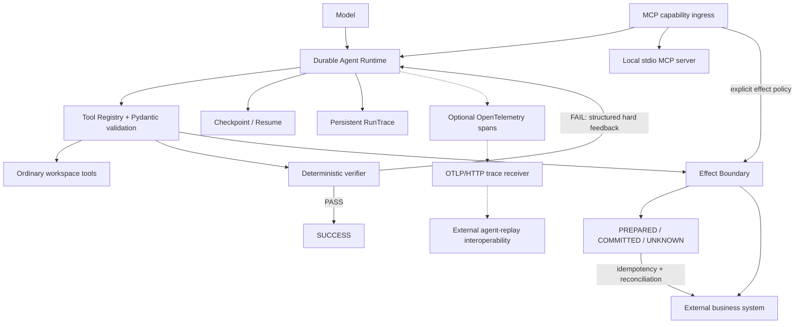

# Reliable Task Agent

Reliable Task Agent is a compact Python runtime for tool-using agents that need durable execution state, deterministic verification, and explicit handling of recoverable side effects. Its premise is simple: **Agent output != task completion**, and **checkpoint absence != proof that an external effect did not happen**. The v0.3.0 capability set combines checkpoint/resume, verifier-driven bounded repair, workspace-scoped tool safety, persistent traces, MCP integration, durable error sanitization, optional OpenTelemetry export, and a durable Effect Boundary for explicitly registered side effects.

> **Agent output != task completion.**
>
> **Checkpoint absence != proof that an external effect did not happen.**

**Checkpoint/Resume · Verifier-driven Repair · Effect Boundary · MCP · OpenTelemetry · Fault Benchmark**

## Why this project exists

A tool-using agent can return a confident answer while its artifact is wrong. It can also crash after an external operation succeeds but before its checkpoint records the completed tool call. These are different failure modes:

```text
model writes artifact -> deterministic verification fails

external side effect succeeds -> process crashes -> completed result is absent
```

Reliable Task Agent treats model output as a proposal, verifies important results with deterministic code, and persists enough execution state to make recovery decisions explicit.

## Key capabilities

- **Agent runtime:** tool-calling loop, OpenAI-compatible client, Pydantic argument validation, bounded steps, and retry with exponential backoff.
- **Durable execution:** persistent traces, checkpoints, resume by `run_id`, pending-call recovery, and reuse of completed Tool Call results.
- **Verifier-driven Repair:** structured verification errors, runtime hard feedback, bounded repair attempts, and crash/resume-safe repair bookkeeping.
- **Effect Boundary:** durable effect identity, receipts, reconciliation, and fail-closed handling for explicitly registered side-effecting tools.
- **MCP Tool Adapter:** official MCP SDK integration for local stdio discovery, schema mapping, ordinary invocation, and explicitly policy-managed MCP effects.
- **Durable Error Sanitization:** exception-derived diagnostics are reduced to structured, persistence-safe metadata before entering durable runtime state.
- **Optional OpenTelemetry:** fail-open manual spans with optional OTLP/HTTP protobuf export; telemetry delivery is never part of runtime correctness.
- **Safety and testing:** workspace-scoped file tools, path-traversal protection, deterministic verification, and failure-injection hooks.

## Architecture



Ordinary tools remain compatible with the Tool Registry. Effect-managed tools must be registered explicitly and can execute only through the Effect Executor.

## Verifier-driven Repair

For verified workflows, a model's final response is not sufficient. The deterministic verifier independently recomputes expected results from source inputs and returns both the backward-compatible `errors` list and structured `error_details` such as `type`, `field`, `expected`, and `actual`.

When verification fails, the runtime:

1. Detects `verification_passed=false` from the verifier result.
2. Appends runtime-generated hard feedback containing `errors` and `error_details`.
3. Persists the incremented `repair_count`, feedback message, and handled verifier Tool Call identity together.
4. Gives the model a bounded opportunity to repair the artifact.
5. Re-verifies the repaired artifact before allowing `SUCCESS`.

`max_repair_attempts` bounds the loop. Persisted `handled_verification_tool_call_ids` make each failed verifier call consume at most one repair cycle, including a crash after the verifier result is saved but before repair bookkeeping finishes.

A real configured-model smoke test exercised the complete path:

```text
Verify FAIL
-> repair_requested
-> structured hard feedback
-> model repairs artifact
-> Verify PASS
-> SUCCESS
```

This demonstrates the implemented workflow; it is not a general self-healing guarantee.

## Durable Side-effect Recovery

A checkpoint alone cannot resolve this crash window:

```text
external side effect succeeds
-> process crashes
-> Agent checkpoint has not persisted CompletedToolCall
```

The missing checkpoint result does not prove that the external operation failed. Blindly invoking the handler again can duplicate the effect.

Effect-managed tools therefore execute through a separate durable Effect Boundary. Before calling the external handler, the runtime persists a `PREPARED` record in the Effect Ledger. The record uses a stable identity derived from `run_id + tool_call_id`, a canonical hash of validated Pydantic arguments, and a stable idempotency key.

A successful execution stores the complete serialized `ToolExecutionResult` receipt and transitions the record to `COMMITTED`. If resume finds `PREPARED`, the runtime reconciles against the business system:

- `FOUND` reconstructs the expected tool result and commits the ledger without rerunning the handler.
- `NOT_FOUND` permits the registered handler to run.
- `UNKNOWN`, including reconciliation errors, is persisted and fails closed.

`COMMITTED` and `UNKNOWN` are terminal for automatic recovery. The included SQLite `create_ticket` workload demonstrates **duplicate-safe recovery for explicitly registered, idempotent/reconcilable side effects under the implemented and tested SQLite semantics.**

## MCP Tool Adapter

The MCP adapter uses the official Model Context Protocol Python SDK. It supports local stdio servers, `tools/list` discovery, JSON input-schema mapping, annotations/metadata preservation, and `tools/call` invocation for explicitly allowlisted ordinary tools.

MCP annotations are retained only as untrusted metadata. They never classify a tool as safe or effect-managed. A side-effecting MCP tool such as `create_ticket` must be selected by explicit local RTA policy and registered through the existing Effect Boundary:

```text
MCP create_ticket
-> explicit RTA effect policy
-> PREPARED
-> MCP tools/call
-> business commit
-> COMMITTED
-> Agent checkpoint
```

Recovery reuses the same Effect Ledger and reconciliation rules as non-MCP effects; there is no second MCP-specific state machine. The ordinary MCP invocation path denies `create_ticket`, preventing it from bypassing the Effect Boundary.

A real configured-model smoke validation used `deepseek-v4-flash` to select MCP `create_ticket`, pass through `PREPARED -> COMMITTED`, create exactly one ticket, persist a completed Agent checkpoint, and return `SUCCESS`. This is evidence for that executed integration path, not a general guarantee about all models, servers, or external systems.

## Durable Error Sanitization

Exception-derived diagnostics cross a narrow sanitization boundary before entering durable `AgentCheckpoint`, `RunTrace`, `EffectStore`, or persisted `ToolExecutionResult.error` fields. Safe durable diagnostics may retain an exception `error_type`, a static code-defined `error_category`, an optional safe numeric HTTP status, and—for Pydantic validation failures—the field path and validation error code.

These durable error summaries do not retain arbitrary raw exception messages, response bodies, Authorization headers, API keys or tokens, credential-bearing URLs or query secrets, MCP server error text, or rejected Pydantic input values. Live exceptions may still preserve their original caller-visible behavior; sanitization applies to the durable copy rather than changing runtime control flow.

This is not general data-loss prevention. Checkpoint and recovery state can still contain task inputs, model messages, tool arguments, successful tool results, and effect receipts required for resume and result reconstruction. Runtime, checkpoint, trace, and Effect Ledger storage must therefore be treated as sensitive application data.

## OpenTelemetry and agent-replay

Manual tracing is optional and defaults to no-op. When configured, RTA emits namespaced spans for the principal boundaries, including `rta.agent.run`, `rta.llm.call`, `rta.tool.execute`, `rta.mcp.call`, `rta.effect`, `rta.reconciliation`, `rta.verifier`, and `rta.repair`.

`Telemetry.from_otlp_http(...)` configures the official OTLP HTTP/protobuf exporter with `service.name=reliable-task-agent`:

```python
telemetry = Telemetry.from_otlp_http(
    "http://127.0.0.1:4318/v1/traces"
)
agent = AgentLoop(..., telemetry=telemetry)
```

Only allowlisted identifiers and state attributes are exported. Prompts, complete model responses, raw tool arguments/results, credentials, headers, `.env` contents, and arbitrary exception strings are excluded. Exporter setup, delivery, flush, and shutdown failures remain isolated from Agent, checkpoint, verifier, and Effect Boundary semantics.

The deterministic [agent-replay interoperability demo](examples/otel_agent_replay_demo.py) requires no real model call. With the external `clay-good/agent-replay` CLI listening on port 4318, the validated path was:

```text
RTA deterministic AgentLoop
-> OTLP/HTTP protobuf
-> agent-replay receiver
-> local agent-replay SQLite trace store
```

The validation ingested a completed five-step trace and preserved this hierarchy:

```text
rta.agent.run
├── rta.llm.call
├── rta.tool.execute
│   └── rta.effect
└── rta.llm.call
```

`agent-replay list`, `show --json`, `show --tree`, and `replay --speed 0` all succeeded. This is **OTLP interoperability, not native agent-replay GenAI semantic mapping**: because RTA uses its own span names rather than recognized GenAI root conventions, agent-replay groups the spans into a synthetic trace using the OpenTelemetry trace ID. Node.js and agent-replay remain external demo prerequisites and are not RTA runtime dependencies.

## Reliability benchmark

The frozen benchmark compares three configurations:

1. **LangGraph checkpoint-only:** an experimental baseline, not recommended production LangGraph practice.
2. **LangGraph + application idempotency:** the fair baseline following documented idempotent-side-effect guidance.
3. **Reliable Task Agent Effect Boundary:** the integrated Agent Loop, Tool Registry, Effect Executor, Effect Ledger, business SQLite, and checkpoint/resume path.

The final run used CPython 3.13.14, SQLite 3.50.4, LangGraph 1.2.11, `langgraph-checkpoint` 4.2.0, and `langgraph-checkpoint-sqlite` 3.1.1. It completed 150/150 ranked trials and 10/10 separate RTA F5 trials, with no exclusions or harness failures. Every ranked cell was uniform across 10 repetitions.

| Configuration | Duplicate trials | Handler invocations | Final success | F2 handlers | F4 handlers |
|---|---:|---:|---:|---:|---:|
| LangGraph checkpoint-only¹ | 20/50 | 80 | 30/50 | 20 | 20 |
| LangGraph + application idempotency | 0/50 | 80 | 50/50 | 20 | 20 |
| RTA Effect Boundary | 0/50 | 60 | 50/50 | 10 | 10 |

¹ Checkpoint-only is an experimental baseline and is not recommended production LangGraph practice.

The application-idempotent LangGraph baseline also achieved **0/50 duplicate trials and 50/50 final success**. The observed distinction is recovery semantics and handler re-entry, not a general reliability ranking.

In each tested F2/F4 10-trial cell, RTA recorded 10 handler invocations versus 20 for the application-idempotent LangGraph baseline (-50%), while both maintained zero duplicate trials and 10/10 final success. This statement is scoped only to those tested ambiguity-window cells; the overall ranked handler counts were 60 for RTA and 80 for the application-idempotent baseline.

F1 provides important context: both systems may execute the handler again when reconciliation determines that the effect did not happen. F3 uses analogous rather than identical internal durability boundaries.

### Descriptive F5 result

F5 is separate RTA-only evidence and is not part of the LangGraph comparison. In 10/10 trials, reconciliation was unavailable, the effect transitioned to `UNKNOWN`, the Agent checkpoint failed, no final `SUCCESS` was returned, and no duplicate business effect was created.

Full tracked evidence:

- [Measured report](benchmarks/results/report.md)
- [Summary CSV](benchmarks/results/summary.csv)
- [Summary JSON](benchmarks/results/summary.json)
- [Pinned environment](benchmarks/results/environment.json)
- [Representative F2 trials](benchmarks/results/representative_trials/)

## Quick start

This project uses [uv](https://docs.astral.sh/uv/).

Normal project/runtime setup does not install the optional benchmark dependencies:

```bash
uv sync
```

Create `.env` from `.env.example` and configure an OpenAI-compatible endpoint with tool calling:

```env
LLM_API_KEY=your_api_key
LLM_BASE_URL=your_openai_compatible_base_url
LLM_MODEL=your_model_name
```

Run the included wireless-link analysis demo:

```bash
uv run reliable-task-agent demo
```

The Agent reads `demo_workspace/config.json`, `experiment_notes.md`, and `results.csv`; writes `analysis_report.md`; and verifies the report against the original inputs. The experiment can fail while the Agent's analysis is correct—the verifier judges the report, not whether the measured system passed its thresholds.

Resume an interrupted run with its printed `run_id`:

```bash
uv run reliable-task-agent resume <run_id>
```

## Built-in tools

| Tool | Purpose |
|---|---|
| `calculate_shannon_capacity` | Calculate Shannon theoretical channel capacity |
| `read_text_file` | Read a text file inside the workspace boundary |
| `list_workspace_files` | Discover workspace files |
| `search_text` | Search text across workspace files |
| `analyze_csv` | Deterministically analyze CSV data |
| `write_analysis_report` | Generate a structured Markdown report |
| `verify_analysis_report` | Independently verify the generated report |

The registry validates arguments before execution and exports tool schemas for the model. Applications register effect-managed tools separately with execute and reconcile handlers.

## Tests

The complete suite includes the cross-runtime benchmark tests, so enable the benchmark dependency group:

```bash
uv run --group benchmark pytest -q
```

Current complete suite:

```text
118 passed
```

Tests cover tool validation, workspace boundaries, retries, traces, checkpoints, resume, completed-result reuse, verifier-driven repair, repair crash windows, Effect Ledger transitions, reconciliation, fail-closed UNKNOWN behavior, durable error sanitization, MCP discovery/invocation/effect recovery, OpenTelemetry/OTLP export, real SQLite fault injection, and the cross-runtime benchmark harness.

## Limitations and non-goals

- Effect recovery applies only to explicitly registered tools whose handlers support the required idempotency and reconciliation contract.
- The Effect Boundary does not provide distributed transactions, rollback, compensation, or safety for arbitrary external APIs.
- It does not establish multi-worker global serialization.
- `UNKNOWN` intentionally requires operator or application-level resolution.
- Verifier-driven repair is bounded and task-specific; a successful smoke test is not a general self-healing guarantee.
- Deterministic verification is only as complete as the verifier's encoded rules.
- MCP support is currently scoped to explicitly configured local stdio servers; MCP annotations are not trusted safety policy.
- OpenTelemetry is observability only. Export failure cannot establish or change task correctness, and the runtime does not include a Collector or backend.
- agent-replay currently represents RTA-specific spans as an OTel-trace-ID-based synthetic trace rather than native GenAI semantic mapping.
- The benchmark uses one deterministic ticket workload, local SQLite, a scripted model client, one Windows host, and pinned dependency versions.
- F3 compares analogous, not identical, internal durability boundaries.
- The benchmark does not measure latency, throughput, concurrency, network partitions, or distributed databases.
- F5 evaluates the configured RTA fail-closed path only and has no ranked LangGraph counterpart.

## Design scope

Reliable Task Agent is an engineering reference implementation for making selected agent workflows more observable, verifiable, and recoverable. It favors explicit contracts—validated tools, deterministic verifiers, bounded repair, durable effect state, and fail-closed ambiguity—over broad claims about autonomous correctness.

The repository contains the runtime under `src/reliable_task_agent/`, deterministic tests under `tests/`, runnable integration demos under `examples/`, the analysis inputs under `demo_workspace/`, and the benchmark plus compact evidence under `benchmarks/`.
